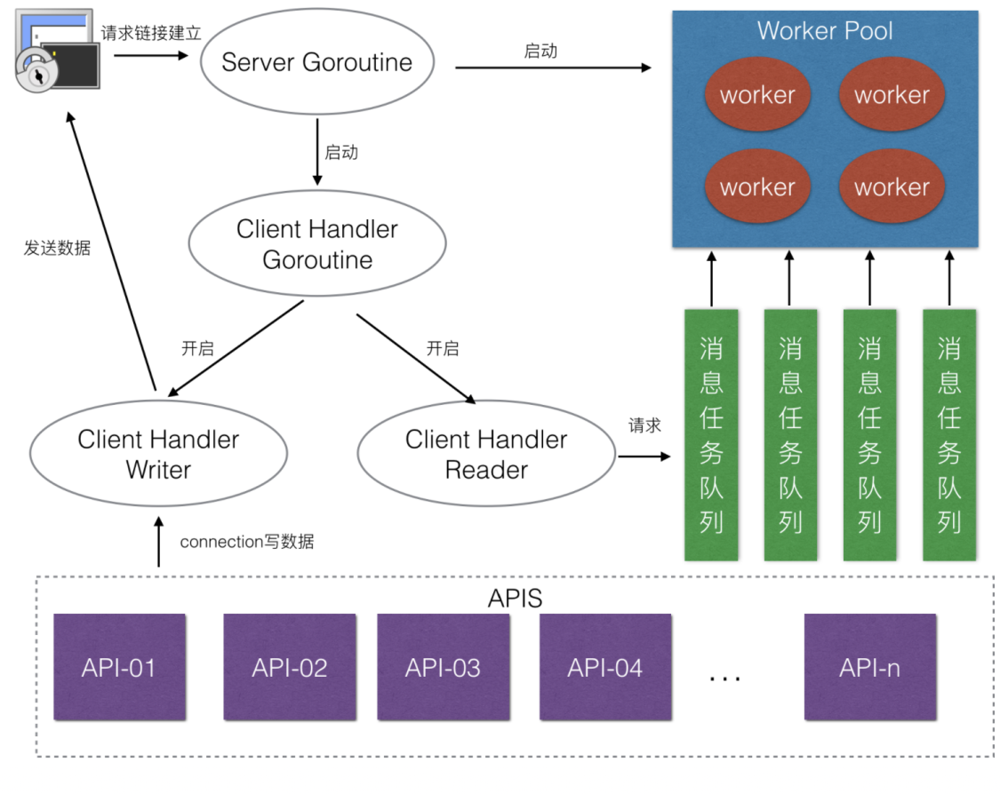

### TCP粘包问题的处理，TLV序列化

### 项目的主要结构的介绍
1. 首先抽象出了connection相关的接口，然后实现了connection的基本功能，包括读写，关闭，获取连接信息等，以及连接属性的一些getter和setter方法
2. 抽象了connectionManager的接口，用于connection的管理
3. 抽象了message的接口，用于message的封装和解封装，为了解决TCP的粘包问题，这里使用了TLV的方式进行封装和解封装
4. 抽象了router接口，定义消息的handler方法，这里使用了代理模式的理念，使用了两个钩子函数，分别是preHandle和postHandle，用于在处理业务之前和之后进行一些操作，比如日志记录等
5. 抽象了msgHandle接口，用于管理router，以及执行router的handler方法，抽象了worker连接池，用于管理worker，通过复用的方式提高资源的利用率
6. 抽象了request接口，是对connection和message的进一步封装
7. 抽象了server的接口，用于管理server，包括启动，停止，路由的注册等，以及使用钩子函数来进行资源的初始化和释放